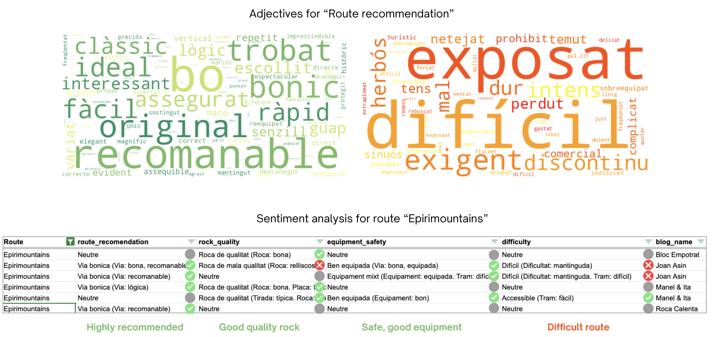

# From Chaos to Crux — Climbing Route Search Engine

**One-liner:** From 12k+ climbing blog posts to a structured dataset of 4k multi-pitch routes enriched with attributes, maps, and recommendations.

## Context
This project was developed during the **Data Science Bootcamp at CodeOp** together with Maria Salvany.  
Motivation: climbers often rely on fragmented blog posts for route information. Our goal was to centralize this knowledge into a structured, searchable dataset.

## Dataset
- 12,000+ blog posts scraped  
- 4,000 unique routes identified  
- 15+ attributes per route (grade, length, pitches, wall, zone, orientation, equipment, etc.)  
- 4 sentiment scores extracted from blog content (enjoyment, difficulty perception, quality, risk)

## Prototype
- Search engine with filters: max grade, obligatory grade, orientation, length, number of pitches, equipment  
- Integrated geolocation search: enter a place, define a radius → get routes nearby  
- Results show route attributes + direct links to original blog posts (to keep context and credibility)

## Tools & Methods
- **Scraping:** BeautifulSoup  
- **NLP:** spaCy (NER), fuzzy matching  
- **Unsupervised ML:** clustering for cleaning and unifying route names/walls  
- **Visualization:** Folium maps  
- **Environment:** Google Colab, Python

## Documentation
- 📊 Presentation slides: [FromChaosToCrux.pdf](docs/FromChaosToCrux.pdf)

## Preview

  
- ## Demo Video
🎥 [Watch the demo of the advanced search engine for multipitch routes](docs/advanced_search_demo.mp4)

## Project Status & Future Work
This repository is intended as a **showcase of our MVP**.  
It contains the project presentation and documentation, but **not the full codebase**.  

### Current Status
- ✅ Data scraped and processed (12k blog posts → 4k unique routes)  
- ✅ Structured dataset with 15+ attributes per route  
- ✅ Sentiment analysis performed on blog text  
- ✅ Prototype search engine with filters, maps, and geolocation  
- ✅ Presentation slides available  

### Future Work
- 🚀 Develop a web application for real-world use  
- 🧹 Expand and refine route data  
- 🗂️ Improve user interface and recommendation features  
- 🔒 Keep the full pipeline private until a public release
